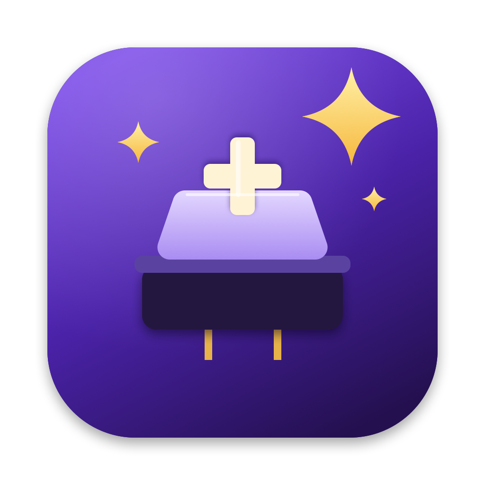

# Switchcraft



A native macOS menu-bar app that turns a MacBook keyboard into a **velocity-sensitive
mechanical keyboard**. Every key press is measured with the MacBook's built-in accelerometer:
soft presses play soft samples, hard presses play hard ones, with continuous crossfades in
between. It works system-wide, offline and locally.

Personal, local software: no accounts, payments, analytics, telemetry or network code.

## Supported Macs

| Mac | Status |
|---|---|
| Apple Silicon MacBook Air / Pro with an SPU accelerometer (`AppleSPUHIDDevice`) | Full support. **Verified on MacBook Air M5 (Mac17,3), macOS 27.0.** |
| Other Apple Silicon MacBooks | Expected to work (the reference project reports M2+); not yet verified. |
| Apple Silicon desktops, Intel Macs | No accelerometer: sounds still work with Fixed or Simulated velocity. |

Requires macOS 14 or later, arm64.

## Build requirements

- Xcode 16 or later (built and tested with Xcode 27.0)
- Optional: [XcodeGen](https://github.com/yonaskolb/XcodeGen) (`brew install xcodegen`) to
  regenerate `Switchcraft.xcodeproj` from `project.yml`. The generated project is committed.

## Build and run

```sh
Scripts/build.sh          # Release build → build/Switchcraft.app
Scripts/test.sh           # unit tests
Scripts/install.sh        # build + install to /Applications + launch
```

Or open `Switchcraft.xcodeproj`, select the **Switchcraft** scheme, and Run (⌘R). Test with ⌘U.

Plain xcodebuild:

```sh
xcodebuild -project Switchcraft.xcodeproj -scheme Switchcraft -configuration Release -derivedDataPath build/DerivedData build
```

## First launch

1. The welcome guide opens. It checks the hardware, asks for Input Monitoring, tests the
   sensor and audio, and offers typing-force calibration.
2. Grant **Input Monitoring** (System Settings › Privacy & Security › Input Monitoring).
   The guide updates by itself once it's on.
3. Switchcraft then lives in the menu bar (switch-and-sparkle icon). There's no Dock icon. Opening the app
   again from Finder/Spotlight shows Settings.

## Permissions

| Permission | Why | Required |
|---|---|---|
| Input Monitoring | A listen-only keyboard event tap that sees key codes and timestamps | Yes |
| Accessibility | — | No: listen-only taps don't need it |
| Microphone | — | No: "mute while the microphone is in use" reads CoreAudio's public *is-running-input* state, it never opens the mic |
| Administrator / root | — | No (see below) |

## Sensor and helper setup

**No helper and no sudo.** On the tested MacBook Air M5 / macOS 27, the accelerometer opens
and streams at ~800 Hz as a normal user. The reference project needs root only because it
writes wake properties to the driver service. Switchcraft writes them to the HID device instead,
which needs no privilege. Details and measurements: [docs/SENSOR.md](docs/SENSOR.md).

If a Mac or macOS version refuses access, Diagnostics shows `SENSOR_PERMISSION_REQUIRED` with
the exact IOReturn code and Switchcraft falls back to Fixed velocity. To check a machine
quickly:

```sh
xcrun swiftc -O Scripts/sensor-probe.swift -o build/sensor-probe && build/sensor-probe 3
```

## Using it

- **Realism:** every key keeps its own recording and sits at its place on the keyboard in the
  stereo field (on a MacBook the speakers flank the keyboard, so the click comes from under your
  finger). A short small-room reflection adds depth. Settings › Sound › *Stereo width* and
  *Room ambience*. Each press is paired with its key-up recording at the press's force
  (Settings › General › *Play key-up sounds*).
- **No "invalid key" beep:** apps beep when they get a key they can't use. Switchcraft mutes
  the macOS alert sound only while you type and restores your alert volume a second after you
  stop, so every other alert still plays (Settings › General). Your previous level is saved
  until restored, even across a crash.
- **Menu bar:** on/off, sound pack, volume, sensitivity (Soft ↔ Aggressive), velocity detection
  (Accelerometer / Fixed / Simulated), Calibrate, Settings, Diagnostics, Launch at Login, Quit.
- **Settings:** General, Sound (packs, preview, import, folder), Typing Force (mode,
  sensitivity, response curve, calibration, Advanced: noise floor, threshold, gain, gamma,
  min/max velocity, correlation window, impact decay), Exclusions (per-app mute, microphone
  mute), Diagnostics, About.
- **Calibration:** two quiet seconds for the noise floor, then 8 soft, 8 normal and 8 hard
  presses. Medians become the soft/normal/hard references. Reset anytime.
- **Diagnostics:** live graph (raw and filtered signal, threshold, key events, correlation
  windows, detected impacts), every sensor/velocity/audio metric, measured latency, sensor
  test, copy/export.

## Sound packs

20 packs of **real switch recordings** ship with the app. All are openly licensed:

| Family | Packs | Recordings |
|---|---|---|
| Cherry MX | Red, Black, Brown, Blue, each with ABS and with PBT keycaps | every key individually, with key-ups ([mechvibes](https://github.com/hainguyents13/mechvibes), MIT) |
| Cherry MX | Clear | stereo, individual presses with key-ups ([humi74 on Freesound](https://freesound.org/s/412926/), CC0) |
| Cherry MX | Silent | cut from fast typing, no key-ups ([bonesawmgraw on Freesound](https://freesound.org/s/572978/), CC0) |
| Tactile | Holy Panda, Topre | per-row hits with key-ups ([kbsim](https://github.com/tplai/kbsim), MIT) |
| Clicky | Kailh Box Navy, Alps SKCM Blue | kbsim |
| Linear | Alpaca, NovelKeys Cream, Turquoise Tealios, Gateron Red Ink, Gateron Black Ink | kbsim |
| Vintage | Buckling Spring | kbsim |

Openly licensed recordings of Cherry MX Silver, Green, White and Grey couldn't be found, so
those aren't included rather than faked. Record your own and import them (see below).

Packs store single full-force hits. Switchcraft generates the four velocity layers from each
hit when the pack loads: soft and medium are darker and quieter, hard is the recording, slam
adds bottom-out weight. Every layer comes from the same hit, so a crossfade changes brightness,
never pitch or timing. Rebuild the bundled packs with:

```sh
Scripts/fetch-sound-sources.sh build/sources
xcrun swiftc -O Scripts/build-sound-packs.swift -o build/build-sound-packs
build/build-sound-packs build/sources SoundPacks
```

Create your own: [docs/SOUNDPACK_FORMAT.md](docs/SOUNDPACK_FORMAT.md). In short, a
`Name.switchcraft` folder with `manifest.json` and `sounds/<group>/<layer>/*.wav`. Import via
Settings › Sound (button or drag-and-drop). User packs live in
`~/Library/Application Support/Switchcraft/SoundPacks`.

## Privacy

Switchcraft listens to the keyboard, so it's built to keep that harmless:

- Only the **key code**, autorepeat flag and timestamp are read. Characters are never requested
  (`keyboardGetUnicodeString` is never called), so words can't be reconstructed.
- Each event is processed and discarded in milliseconds. No keystroke history is stored. The
  only retained data is a few recent timestamps for the debug graph and the *last* key code
  shown on screen.
- Logs contain no characters. Exported diagnostics omit even the last key code.
- No network code, no analytics or tracking SDKs, no third-party dependencies at all. Verify
  with `lsof -i -a -p $(pgrep -x Switchcraft)` (no sockets).
- Clipboard is never read.
- Secure input (password fields) is respected: macOS hides those keystrokes from every app,
  Switchcraft included.

Stored locally: preferences and calibration (UserDefaults, `com.switchcraft.app`) and imported
packs (Application Support).

## Troubleshooting

See [docs/TROUBLESHOOTING.md](docs/TROUBLESHOOTING.md). The most common issue: after rebuilding,
remove and re-add Switchcraft in Input Monitoring, because local builds are ad-hoc signed.

## Architecture

See [docs/ARCHITECTURE.md](docs/ARCHITECTURE.md). In short:

```
CGEventTap ─► KeyEvent ─► TypingPipeline (own queue) ─► SoundEngine ─► VoiceMixer (render thread)
                              ▲
HID 800 Hz ─► ImpactFilter ─► SampleRing
```

- `SwitchcraftCore`: pure, tested logic (DSP, mapping, packs, settings, pipeline).
- `Switchcraft`: hardware and UI.
- Swift 6 strict concurrency; realtime paths don't allocate or block.

## Credits and licences

- Accelerometer access is based on
  [olvvier/apple-silicon-accelerometer](https://github.com/olvvier/apple-silicon-accelerometer),
  MIT License © 2026 olvvier. Full text in
  [LICENSES/apple-silicon-accelerometer-MIT.txt](LICENSES/apple-silicon-accelerometer-MIT.txt).
- Inspired by the *functionality* of Haptyk. No Haptyk code, branding, recordings or assets
  are used.
- Switch recordings:
  - [hainguyents13/mechvibes](https://github.com/hainguyents13/mechvibes), MIT License © 2021 Hai
    Nguyen ([LICENSES/mechvibes-MIT.txt](LICENSES/mechvibes-MIT.txt)): Cherry MX Red/Black/Brown/Blue.
  - [tplai/kbsim](https://github.com/tplai/kbsim), MIT License © Thomas Lai
    ([LICENSES/kbsim-MIT.txt](LICENSES/kbsim-MIT.txt)): the other switches.
  - Freesound, CC0 1.0: “Mechanical keyboard clicking. Different keys” by humi74 (Cherry MX
    Clear), “Typing Fast_A01” by bonesawmgraw (Cherry MX Silent).
  - mechvibes and kbsim don't name the original recordists; their audio is used as distributed
    under those repositories' MIT licenses. Switchcraft segments the recordings and derives the
    velocity layers.
- App icon and menu-bar glyph are drawn by `Scripts/make-icon.swift`.
