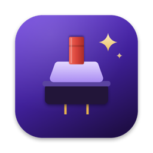
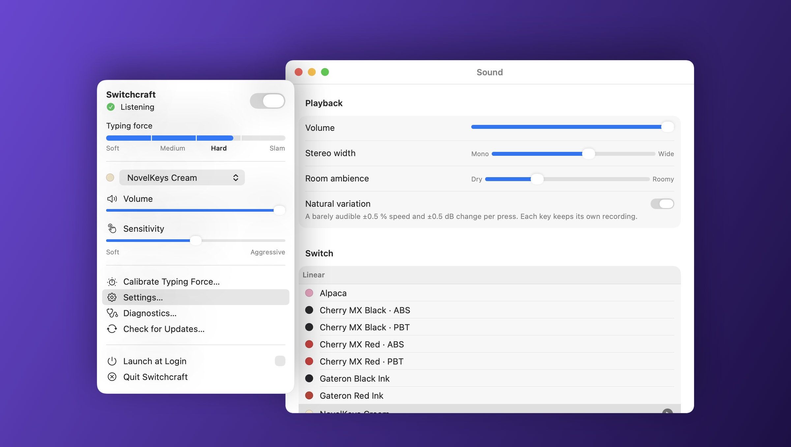
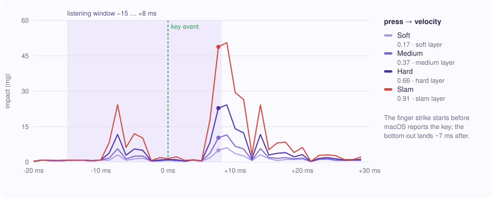
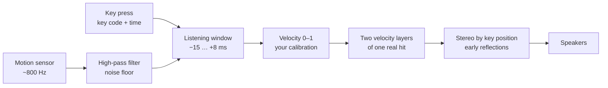
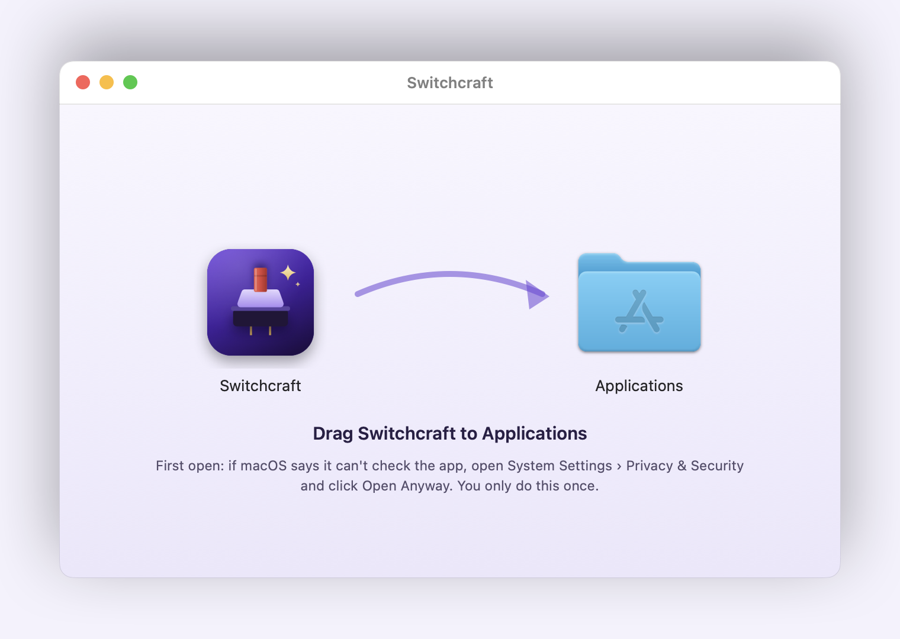

<div align="center">



# Switchcraft

**Your MacBook keyboard, with the sound of a real mechanical switch, at the force you typed it.**
Switchcraft feels how hard each key lands through the MacBook's built-in motion sensor and plays
a recording of a real switch to match. Soft presses sound soft. Hard presses sound hard.

[](https://github.com/mustafa4101996ahmed/switchcraft/releases/latest/download/Switchcraft.dmg)
[](https://github.com/mustafa4101996ahmed/switchcraft/actions/workflows/tests.yml)
[](LICENSE)


</div>

<p align="center">
  
</p>

<p align="center">
  <em>The menu-bar panel and Sound settings, rendered from the app's own views.<br>
  The meter shows how hard your last key landed, from soft to slam.</em>
</p>

---

> [!IMPORTANT]
> **Typing force is measured, never invented.** Every velocity comes from the accelerometer
> reading of that key press. When the sensor can't be read, Switchcraft says so and plays every
> key at one fixed strength instead of faking dynamics it cannot see.

## How it works

Every key press shakes the MacBook's case a little, and a harder press shakes it more. Apple
Silicon MacBooks carry a motion sensor that macOS doesn't expose through any public API.
Switchcraft reads it directly at about 800 samples a second, as your user, with no root helper.

<p align="center">
  
</p>

<p align="center">
  <em>Four presses through the app's real filter, detector and velocity mapper. The presses are
  the keystroke model the tests use,<br>shaped on a recording from a MacBook Air M5. Generated by
  <a href="Scripts/make-keystroke-chart.sh"><code>make-keystroke-chart.sh</code></a>, not drawn by hand.</em>
</p>

The finger hits the keycap before macOS registers the key, and the switch bottoms out about
7 ms after. Switchcraft listens from 15 ms before each key event to 8 ms after, takes the
strongest impact in that window, and maps it to a velocity between 0 and 1 using your own
calibration.



Each pack stores single real hits. At load, Switchcraft generates four layers from every hit:
soft and medium are darker and quieter, hard is the recording itself, slam adds bottom-out
weight. A press at 0.4 blends the two nearest layers. Both come from the same hit, so the blend
changes brightness and never pitch or timing. Each key keeps its own recording and sits where it
is on the keyboard, so the click comes from under your finger.

### What is verified today

| Surface | State |
|---|---|
| Sensor access as a normal user, no helper, no `sudo` | Verified on a MacBook Air M5 (Mac17,3), macOS 27.0: 801.6 samples/s |
| Other Apple Silicon MacBooks (M1–M4) | Not yet verified. The approach comes from a project tested on M2 and later |
| Desktop and Intel Macs | No motion sensor: Switchcraft plays every key at one fixed strength |
| Impact detection: soft to slam, desk bumps, laptop moved, trackpad clicks, fast typing, two-key chords | Covered by unit tests on deterministic sensor fixtures |
| No echo after a key | Every bundled clip (1,422 presses and key-ups) checked: no second hit after the attack, reflections end within 15 ms, key-ups sit ≥ 9 dB under the press |
| Swift 6 strict concurrency, Thread Sanitizer | Clean: zero warnings, zero data races in the tests and a live sensor run |
| Latency | The listening window adds 8 ms by design. Diagnostics measures key → audio for every press |
| Gatekeeper | Not notarized yet: one "Open Anyway" the first time you open it |

## Install

**You need** an Apple Silicon MacBook on macOS 14 or later.

1. Download **[Switchcraft.dmg](https://github.com/mustafa4101996ahmed/switchcraft/releases/latest/download/Switchcraft.dmg)**
   and open it.
2. Drag **Switchcraft** into **Applications**.
3. Open it. The first time, macOS says it can't check the app: open
   **System Settings › Privacy & Security**, scroll down, and click **Open Anyway**.
4. Follow the setup guide and allow **Input Monitoring** when it asks.

<p align="center">
  
</p>

> [!NOTE]
> Switchcraft isn't signed with an Apple Developer ID yet, which is why macOS asks once. It has no
> analytics and sends nothing from your Mac. Its only network request is a daily check of GitHub for
> a newer release, and it asks before downloading one (menu-bar icon › Check for Updates… any time).
> Updates keep their Input Monitoring permission, because every release is signed with the same
> local identity.

After setup Switchcraft lives in the menu bar. `⌃⌥⌘K` turns the sounds on or off from any app,
and `⌘,` opens Settings while the panel is open.

## The 20 switches

| Family | Switches | Recordings |
|---|---|---|
| Cherry MX | Red, Black, Brown, Blue: each with ABS and with PBT keycaps | Every key recorded on its own, with key-ups ([mechvibes](https://github.com/hainguyents13/mechvibes), MIT) |
| Cherry MX | Clear | Stereo recording of single presses, with key-ups ([humi74](https://freesound.org/s/412926/), CC0) |
| Cherry MX | Silent | Cut from fast typing, no key-ups ([bonesawmgraw](https://freesound.org/s/572978/), CC0) |
| Linear | Alpaca, NovelKeys Cream, Turquoise Tealios, Gateron Red Ink, Gateron Black Ink | One hit per keyboard row, Space, Enter and Backspace, with key-ups ([kbsim](https://github.com/tplai/kbsim), MIT) |
| Tactile | Holy Panda, Topre | kbsim |
| Clicky | Kailh Box Navy, Alps SKCM Blue | kbsim |
| Vintage | Buckling Spring | kbsim |

Openly licensed recordings of Cherry MX Silver, Green, White and Grey don't exist yet, so those
aren't included rather than faked. Record your own and drop the folder onto the switch list:
the [pack format](docs/SOUNDPACK_FORMAT.md) generates all four velocity layers from one
recording per key.

## Privacy

Switchcraft hears the keyboard, so it is built to keep that harmless.

| What | How |
|---|---|
| Keystrokes | A listen-only tap reads the key code and timestamp. Characters are never requested, so words can't be rebuilt |
| History | Each press is processed and discarded in milliseconds. Nothing is stored or logged |
| Network | One request a day to GitHub's public releases API, to see if a newer version exists. Nothing about you or your typing is sent. No third-party dependencies |
| Microphone | Never opened. "Mute while the microphone is in use" reads CoreAudio's public *is-recording* flag |
| Password fields | macOS hides them from every app, Switchcraft included |
| The alert beep | Lowered only while you type and restored a second later, even after a crash |

## Build from source

**You need** Xcode 16 or later. [XcodeGen](https://github.com/yonaskolb/XcodeGen) is optional: the
generated project is committed.

```bash
git clone https://github.com/mustafa4101996ahmed/switchcraft ~/Switchcraft && cd ~/Switchcraft
Scripts/setup-signing.sh     # once: a local signing identity, so rebuilds keep their permissions
Scripts/install.sh           # build Release, install to /Applications, launch
```

```bash
Scripts/build.sh             # build/Switchcraft.app only
Scripts/test.sh              # the unit tests
Scripts/release.sh 1.1.0     # build/Switchcraft.dmg; add --publish to tag and upload a release
```

## Tests

```bash
Scripts/test.sh              # 87 tests in 12 suites, under a second
```

The suites cover key classification, velocity mapping and calibration, sound-pack parsing and
validation (including path traversal), impact detection against synthetic sensor fixtures,
the press-to-sound pipeline through mocked hardware, settings persistence and migration, layer
generation, key positions and the early reflections. Hardware paths (the sensor, the key tap,
audio output) are verified on a real MacBook and through Diagnostics, not in CI.

The fixtures earned their place. The first test run failed because the synthetic keypress peaked
at half the strength it claimed, and its peak landed outside the listening window. The detector
was fine; the model of a keystroke wasn't. The echo users heard came from three places at once:
a reverb, key-ups as loud as presses, and a blip baked into one source recording. Only listening
found it. The per-clip checks in this repository now guard all three.

## Repository map

```
Switchcraft/           the app: SwiftUI + AppKit
  Application/         entry point, app state, windows, system events, beep suppressor, hotkey
  MenuBar/             the menu-bar panel
  Preferences/         the Settings panes
  Onboarding/          setup guide and calibration
  Diagnostics/         live sensor graph, report, debug-only renderers for these images
  Keyboard/            the listen-only key tap: key codes, never characters
  Sensors/             the motion sensor over IOKit HID, hardware detection
  Audio/               AVAudioEngine host, realtime voice mixer, decoded sample bank
  SoundPacks/          bundled and imported pack library
  Components/          shared views: status label, force meter, stem swatches
SwitchcraftCore/       pure logic, all unit-tested: DSP, velocity, packs, settings, pipeline
SwitchcraftTests/      87 tests in 12 suites
SoundPacks/            the 20 switches, built by Scripts/build-sound-packs.swift
Scripts/               build, test, install, release, signing, pack and image generators
docs/                  architecture, sensor research, pack format, troubleshooting
LICENSES/              third-party licences, also shipped inside the app
```

Only `Sensors/` talks to the motion sensor and only `Keyboard/` sees key events. The press-to-sound
path runs on its own threads and never waits on the main thread or the disk.

## Documentation

| File | What is in it |
|---|---|
| [`docs/ARCHITECTURE.md`](docs/ARCHITECTURE.md) | Threads, the press-to-sound path, concurrency rules, lifecycle and resilience |
| [`docs/SENSOR.md`](docs/SENSOR.md) | How the motion sensor is read without root, and the measurements behind the timings |
| [`docs/SOUNDPACK_FORMAT.md`](docs/SOUNDPACK_FORMAT.md) | Make your own switch pack: layout, manifest, generated layers, fallbacks |
| [`docs/TROUBLESHOOTING.md`](docs/TROUBLESHOOTING.md) | No sound, every key the same, late sounds, echo, only modifier keys sounding, the alert beep |

## Star History

<a href="https://www.star-history.com/?repos=mustafa4101996ahmed%2Fswitchcraft&type=timeline&logscale=&releases=&legend=bottom-right">
 <picture>
   <source media="(prefers-color-scheme: dark)" srcset="https://api.star-history.com/chart?repos=mustafa4101996ahmed/switchcraft&type=timeline&theme=dark&legend=bottom-right" />
   <source media="(prefers-color-scheme: light)" srcset="https://api.star-history.com/chart?repos=mustafa4101996ahmed/switchcraft&type=timeline&legend=bottom-right" />
   
 </picture>
</a>

## Licence

[MIT](LICENSE). Use it, fork it, ship it. The bundled recordings and the sensor approach keep
their own licences, listed in [`LICENSES/`](LICENSES): mechvibes and kbsim (MIT), Freesound
(CC0), [olvvier/apple-silicon-accelerometer](https://github.com/olvvier/apple-silicon-accelerometer)
(MIT).
